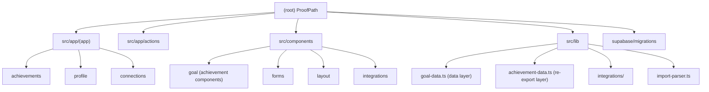

# ProofPath — Root CLAUDE.md

> Last scanned: 2026-03-22T15:04:47Z
> Phase: Phase 1 + Phase 2 complete. Phase 3 (Manager Review) in progress.

---

## Changelog

| Date | Change |
|------|--------|
| 2026-03-22 | Initial CLAUDE.md generated by architecture scan |

---

## Product Positioning

**ProofPath** is a lightweight proof-of-work layer that sits above existing tools.
It ingests work signals — goals, tasks, outcomes, evidence — and transforms them
into trusted, portable achievement records that employees can carry across roles,
performance cycles, and careers.

**ProofPath IS:**
- A performance proof layer (not a task manager)
- A trust and validation layer over existing work systems
- A portable, permissioned proof profile for employees

**ProofPath is NOT:**
- Not a KPI dashboard (not replacing Looker/Metabase)
- Not a task manager (not replacing Jira/Linear)
- Not an HR or OKR platform (not replacing Lattice/Workday)
- Not an AI reasoning system — deterministic trust scoring only

Core motto: "Don't track more work. Prove the work that already happened."

---

## Architecture Overview

```
App Layer (Next.js 15 App Router)
   /proof-feed  /achievements  /profile  /connections
        |
Ingestion Layer
   Manual entry | CSV/JSON import | Connected tools (GitHub, Jira, Linear, Asana)
        |
Proof Layer
   Signal -> Evidence -> Achievement Record (trust-scored)
        |
Trust Layer
   computeTrustLevel() in evidence-actions.ts
   draft -> self_reported -> imported -> reviewer_approved -> system_verified -> locked_proof
        |
Profile / Export Layer
   ProofProfile aggregates locked AchievementRecords
   Shareable export via export_token (Phase 5)
```

Auth: Supabase Auth + middleware.ts enforces session on all non-public routes.
Data: All DB queries go through Server Components or Server Actions — no client-side Supabase calls in app routes.

---

## Module Structure



---

## Module Index

| Module | Path | Responsibility |
|--------|------|----------------|
| Achievements routes | `src/app/(app)/achievements/` | List, detail, new, edit, import views |
| Profile route | `src/app/(app)/profile/` | Proof Profile — trust score, verified records |
| Connections route | `src/app/(app)/connections/` | OAuth-based tool integrations (GitHub, Jira, Linear, Asana) |
| Server Actions | `src/app/actions/` | achievement, evidence, task, goal, import mutations |
| API routes | `src/app/api/integrations/[provider]/` | OAuth authorize, callback, sync endpoints |
| Goal components | `src/components/goal/` | GoalRow, TrustBadge, TrustLadder, EvidenceCard, TaskRow |
| Form components | `src/components/forms/` | GoalForm, EvidenceForm, TaskForm, ImportForm |
| Layout components | `src/components/layout/` | AppShell, Sidebar, FilterBar |
| Integration components | `src/components/integrations/` | IntegrationCard |
| Data layer | `src/lib/` | goal-data.ts, achievement-data.ts, import-parser.ts, supabase-server.ts |
| Migrations | `supabase/migrations/` | 001-009 SQL migrations; 008-009 are ProofPath-specific |

---

## Tech Stack

| Layer | Technology |
|-------|-----------|
| Frontend | Next.js 15.2.6 (App Router, React 19, TypeScript 5) |
| Styling | Tailwind CSS 3.4 + tailwind-merge + clsx |
| Backend | Supabase (PostgreSQL + Auth + RLS) |
| Auth middleware | @supabase/ssr (cookie-based session) |
| Server mutations | Next.js Server Actions (`'use server'`) |
| Charts | Recharts 2 |
| Icons | lucide-react |
| Testing | Vitest 4 + @testing-library/react + jsdom |
| Legacy server | Express under /server (not part of ProofPath core) |

---

## Directory Structure

```
src/
  app/
    layout.tsx                  Root layout — sets dark class, metadata
    globals.css                 Global styles
    middleware.ts               Auth guard — redirects unauthenticated users to /login
    (app)/
      layout.tsx                AppShell wrapper — auth check + workspace resolution
      page.tsx                  Proof Feed (dashboard)
      achievements/             Achievement CRUD routes
      profile/                  Proof Profile route
      connections/              Tool connections route
      goals/                    Legacy goal routes (still active)
      objectives/               Legacy OKR routes (still active)
      onboarding/               Workspace onboarding
      alerts/                   KPI alerts (legacy)
      insights/                 AI Insights (legacy)
    (auth)/
      login/ signup/            Auth pages
    actions/
      achievement-actions.ts    createAchievement, updateAchievement
      evidence-actions.ts       createEvidence, deleteEvidence + trust recompute
      task-actions.ts           createTask
      goal-actions.ts           createGoal, updateGoal (legacy path)
      import-actions.ts         importGoals (bulk CSV/JSON)
      objective-actions.ts      OKR objective mutations (legacy)
    api/
      integrations/[provider]/  authorize, callback, sync API routes
      auth/callback/            Supabase OAuth callback
  components/
    goal/                       Achievement/trust/evidence UI components
    forms/                      GoalForm, EvidenceForm, TaskForm, ImportForm
    layout/                     AppShell, Sidebar, FilterBar
    kpi/                        KPI chart components (legacy)
    okr/                        OKR components (legacy)
    dashboard/                  Dashboard view components (partially legacy)
    integrations/               IntegrationCard
  lib/
    goal-data.ts                Primary data layer (queries goals, evidence, tasks, KPIs)
    achievement-data.ts         Re-export shim with ProofPath semantic aliases
    import-parser.ts            CSV/JSON parser + validator for bulk import
    supabase-server.ts          createServerSupabaseClient factory
    supabase.ts                 Browser Supabase client
    auth.ts                     Auth utilities
    utils.ts                    cn(), formatNumber()
    integrations/               Provider-specific fetch functions + types
supabase/
  migrations/
    001_enums.sql               Core enums
    002_tables.sql              Core tables
    003_indexes.sql             Indexes
    004_rls.sql                 Row Level Security policies
    005_create_workspace_rpc.sql Workspace creation RPC
    006_okr_extensions.sql      OKR extensions (legacy)
    007_integrations.sql        Integration tables
    008_proofpath_schema.sql    ProofPath: outcome_summary, period_label, achievement_records
    009_evidence_trust.sql      Evidence source_type, trust indices
docs/
  PROOFPATH_ARCHITECTURE.md     Canonical architecture + build sequence
  product.md                    Product vision
  mvp-scope.md                  MVP scope decisions
  user-roles.md                 User role definitions
```

---

## Current Development Phase

| Phase | Description | Status |
|-------|-------------|--------|
| Phase 1 | Foundation Reframe — rename routes, DB migration, sidebar nav | Complete |
| Phase 2 | Evidence & Trust — EvidenceForm, evidence-actions, trust auto-compute | Complete |
| Phase 3 | Manager Review Flow — /achievements/[id]/review, review-actions | In Progress |
| Phase 4 | Proof Profile — ProofProfileCard, AchievementRecordCard, trust score | Partial (profile page exists, locked records UI pending) |
| Phase 5 | Export & Portability — export_token, public proof view | Not Started |
| Phase 6 | Signal Ingestion — full GitHub/Linear/Jira sync to Evidence | Scaffolded |

---

## Running the Project

```bash
# Install dependencies
npm install

# Development (Next.js + Express legacy server)
npm run dev          # runs both next dev and node server/server.js concurrently
npm run dev:next     # Next.js only (sufficient for ProofPath routes)

# Build and production
npm run build
npm run start

# Type checking
npm run typecheck

# Tests
npm run test         # vitest run (single pass)
npm run test:watch   # vitest watch mode

# Linting
npm run lint
```

Required environment variables (`.env.local`):
```
NEXT_PUBLIC_SUPABASE_URL=
NEXT_PUBLIC_SUPABASE_ANON_KEY=
NEXT_PUBLIC_APP_URL=http://localhost:3000

# OAuth integration keys (optional — only needed for Connections)
GITHUB_CLIENT_ID=
GITHUB_CLIENT_SECRET=
JIRA_CLIENT_ID=
JIRA_CLIENT_SECRET=
LINEAR_CLIENT_ID=
LINEAR_CLIENT_SECRET=
ASANA_CLIENT_ID=
ASANA_CLIENT_SECRET=
```

---

## Core Conventions

1. **Dark theme enforced** — `<html lang="en" className="dark">` in root layout. All components must use dark-mode-first Tailwind classes (`bg-gray-900`, `text-gray-50`, etc.). Never assume light mode.
2. **Server Actions are the mutation path** — All create/update/delete goes through `src/app/actions/`. Do not PUT/POST to API routes for mutations.
3. **`/achievements/*` is the primary route** — GoalRow, GoalForm, evidence, tasks all link to `/achievements/[id]`. Legacy `/goals/*` routes still exist but are being phased out.
4. **`goal-data.ts` is the source of truth for DB types** — `achievement-data.ts` is a re-export shim. Do not duplicate type definitions.
5. **Trust level is auto-computed, never manually set below `reviewer_approved`** — `recomputeAchievementTrust()` in evidence-actions.ts handles this. Protected levels: `reviewer_approved`, `system_verified`, `locked_proof`.
6. **No N+1 queries** — `fetchWorkspaceGoals()` batches all count queries in parallel using `Promise.all`.
7. **Server Components for reads, Client Components for interactions** — Pages are async Server Components. Forms (`EvidenceForm`, `TaskForm`, `GoalForm`) are `'use client'`.
8. **`createServerSupabaseClient()` for all server-side DB access** — import from `@/lib/supabase-server`.

---

## Testing Strategy

- Framework: Vitest with @testing-library/react
- Test files: co-located in `__tests__/` subdirectories next to components
- Covered: `TrustBadge`, `EvidenceCard`, `GoalRow`, `GoalCard`, `TaskRow`, `GoalStatusBadge`, `utils.ts`, `trend-badge`
- Not covered: Server Actions (need integration tests), data layer functions, import-parser (unit tests pending)
- Run: `npm run test`

---

## Coding Rules

- Do not rebuild the KPI dashboard — `kpi/` components are legacy, not ProofPath core
- Do not replace existing integrations/tools with new ones
- Do not introduce LangChain, LangGraph, or any LLM reasoning in trust computation
- Do not hardcode workspace IDs or user IDs in Server Actions — always resolve via Supabase session
- Extend `goal-data.ts` types; do not copy-paste types across files
- Follow the build sequence in `docs/PROOFPATH_ARCHITECTURE.md` before adding new routes
- Migrations are append-only — never alter 001-007 migrations

---

## AI Usage Guidelines

- Use AI for: scaffolding new Server Actions, generating test cases for new components, drafting Supabase migration SQL
- Do NOT use AI to: rewrite trust scoring logic, restructure the data layer, make architectural decisions without consulting `docs/PROOFPATH_ARCHITECTURE.md`
- Trust scoring (`computeTrustLevel`) is deterministic — no AI substitution
- When generating components, follow the dark-first Tailwind pattern from existing components in `src/components/goal/`
